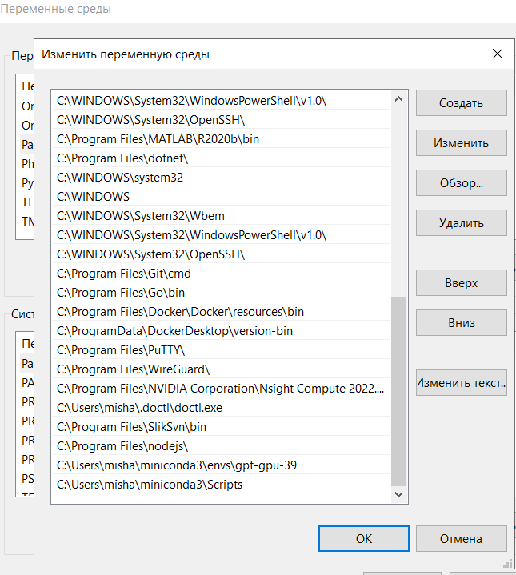

# Configuration
## For local execution
### Windows
Set env variables in system settings for path with 
usage python interpreter for python repo with colored
and usage conda. Then reboot computer.
For example:
