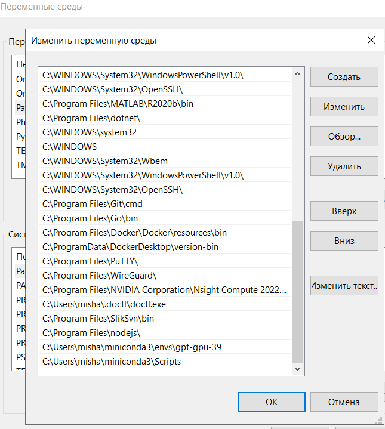

# Configuration
Before setup this repo, you need to get https://github.com/ACE-777/chatgpt-research ang loaclly set up it.

## For local execution
### Windows
1. Set env variables in system settings for path with 
usage python interpreter for python repo with colored
and usage conda.Do it like on screenshot `C:Users\misha\miniconda3\envs\gpt-gpu-39` and 
`C:Users\misha\miniconda3\Scripts`.Then reboot computer.



2. Then you need to write absolute path to python scripts dir of https://github.com/ACE-777/chatgpt-research in 
`internal\metrics\colored.go` constant `repoDir`.


3. Then you can choose type of algorithm version with constant pythonScript in `internal\metrics\colored.go`.


4. After you can run server with tool from the root of the present repository:
```bash
go run cmd\toloka-metrics\main.go
```

5. Go to home page of tool http:\\localhost:8080\home